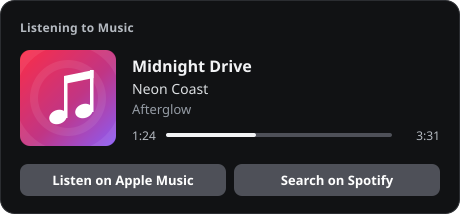

<h1 align="center">apple-music-discord-rpc</h1>

<p align="center">
  apple music → discord rich presence · macOS · zero dependencies
</p>

<p align="center">
  
  
  
  
</p>

<br>

<p align="center">
  
</p>

<br>

### about

Shows what you're listening to in Apple Music on your Discord profile — track, artist,
cover art, a live progress bar and links to the song.

Runs as a tiny background agent: no menu bar icon, no Electron, no dependencies. Just
Node.js talking to Music.app through osascript and to Discord through its local IPC socket.
Written from scratch, inspired by [NextFire/apple-music-discord-rpc](https://github.com/NextFire/apple-music-discord-rpc).

<br>

### features

- **live progress** — elapsed & remaining time, picks up skips and seeks within seconds
- **cover art & links** — artwork plus song, album and artist links from the Apple Music catalog
- **local files too** — tracks the catalog doesn't know still get their embedded artwork
- **only while playing** — clears on pause or when Music quits, or keep it while paused
- **any client** — Discord, PTB, Canary, Vesktop and other arRPC clients
- **lightweight** — one Node process, cached lookups, polls slower while nothing plays
- **set & forget** — starts at login through launchd and restarts itself if anything breaks

<br>

### install

macOS + [Node.js](https://nodejs.org) 22.18 or newer (`brew install node`)

```sh
git clone https://github.com/xr7uz/apple-music-discord-rpc.git
cd apple-music-discord-rpc
./scripts/install.sh
```

On first start macOS asks whether **node** may control **Music** and **System Events** → allow.

| | |
| --- | --- |
| update | `git pull && ./scripts/install.sh` |
| uninstall | `./scripts/uninstall.sh` |
| logs | `tail -f ~/Library/Logs/apple-music-discord-rpc.log` |
| run without the agent | `npm start` |

<br>

### config

Optional — `cp .env.example .env`, edit it, then run `./scripts/install.sh` again.

| variable | default | |
| --- | --- | --- |
| `MUSIC_RPC_COUNTRY` | `us` | Apple Music storefront for artwork & links, e.g. `de` |
| `MUSIC_RPC_BUTTONS` | `apple,spotify` | up to two of `apple` `spotify` `youtube`, or `none` |
| `MUSIC_RPC_SHOW_PAUSED` | `false` | keep the presence while paused |
| `MUSIC_RPC_UPLOAD_ARTWORK` | `true` | upload local artwork to [litterbox](https://litterbox.catbox.moe) (gone after 1h) when the catalog has none |
| `MUSIC_RPC_POLL_MS` | `5000` | poll interval while Music is open |
| `MUSIC_RPC_CLIENT_ID` | public "Music" app | your own [Discord application](https://discord.com/developers/applications), its name shows in "Listening to …" |
| `MUSIC_RPC_DEBUG` | `false` | verbose logs |

<br>

### how it works

```
Music.app ── osascript ──▶ music.ts ──┐
                                      ├──▶ presence.ts ── ipc socket ──▶ Discord
iTunes Search API ──────▶ lookup.ts ──┘
```

- [`music.ts`](src/music.ts) reads player state and current track with one JXA call per tick
- [`lookup.ts`](src/lookup.ts) finds the track in the catalog and caches it in `~/Library/Caches`
- [`presence.ts`](src/presence.ts) builds the activity, only real changes get sent
- [`discord.ts`](src/discord.ts) speaks Discord's IPC protocol directly, no SDK

<br>

### dev

```sh
npm install      # typescript + node types, dev only
npm run check    # typecheck
npm test         # node:test, runs on any OS
```

<br>

### stack

<p align="center">
  
</p>

<br>

<p align="center">
  <a href="https://github.com/xr7uz">
    
  </a>
  &nbsp;
  <a href="https://xr7uz.xyz">
    
  </a>
</p>

<p align="center"><sub>MIT · not affiliated with Apple or Discord</sub></p>
